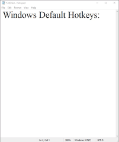
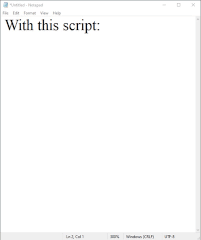

# japanese-keyboard-fastswitch
I switch often back and forth between the English and Japanese keyboards.
In windows, this requires a very unergnomic 4 keystrokes pressed in this sequence: 

`⊞ + spacebar`,   then   `alt + ~`

*(notice how much your left hand has to contort to do this sequence)*

This autohotkey script makes a single key `CapsLock` toggle back and forth between Japanese and English. Notice how much faster I can switch between languages:

 

## Lessons Learned
- basic autohotkey syntax
- How to screenrecord keystrokes using [Captura](https://mathewsachin.github.io/Captura/)

## Headaches I Encountered
- Every physical key does not correspond 1-to-1 with a virtual key that windows registers 🤯. Depending on your active language and keyboard, a physical key can map to different virtual keys.
- Some keys (like the `fn` key) are not re-programmable because they are controlled directly by your hardware's BIOS
- Use `sleep, 200` in between keystroke sequences

## Technologies Practiced
- Autohotkey
- Windows Command Line