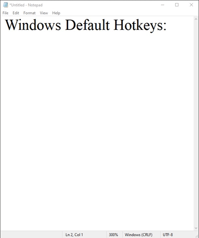
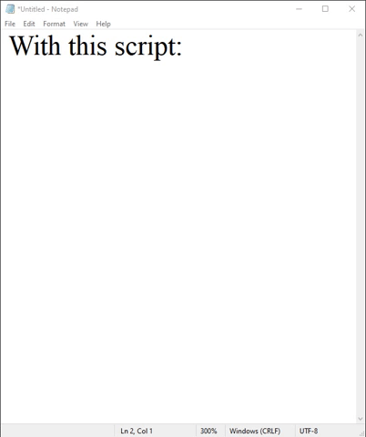

# japanese-keyboard-fastswitch
I switch often back and forth between the English and Japanese keyboards.
In windows, this switch requires a very unergnomic 4 keystrokes pressed in this sequence: `⊞+spacebar` then `alt+tilde`

This autohotkey script makes a single key `CapsLock` toggle back and forth between Japanese and English.

 

